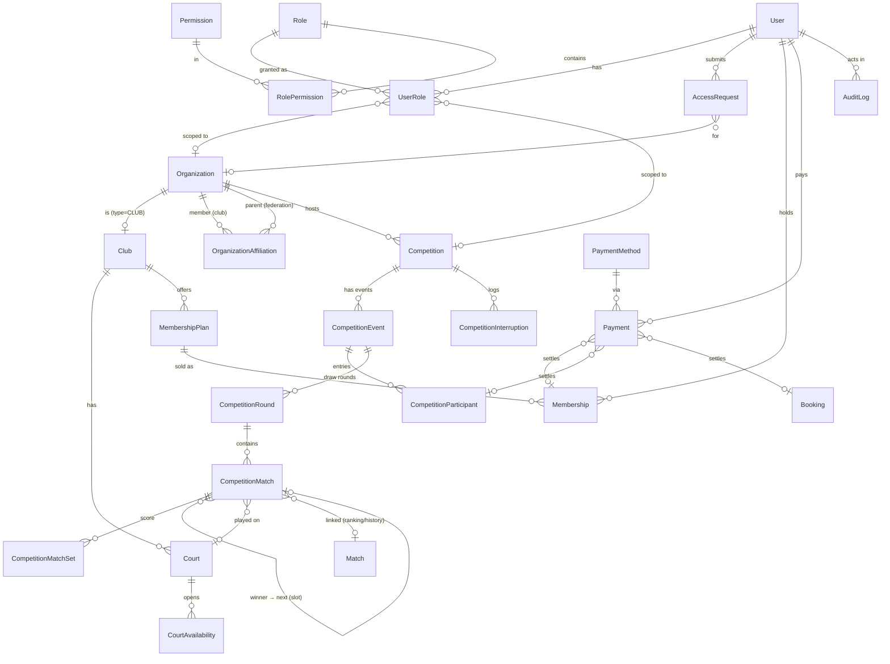

# Tennis Back-Office — Architecture & Backend Gap Analysis

Status: **approved on 2026-09-28** with every recommendation in "Decisions"
accepted, plus two additions from review: level-based sub-tournaments (§2.8a)
and empty or replaceable draw places (§2.8b). Implementation proceeds by phase (Part 7). **Done: Phases 1–8 (foundation, platform administration, organizations/clubs/courts, members & payments, tournaments & entries, draws, matches & scheduling, fees / announcements / reports / rankings).**

Decisions are marked **[D1]…[D12]** and collected in "Decisions" at the end.

---

## Part 1 — Analysis of the existing backend

### 1.1 Current architecture

| Aspect | Today |
|---|---|
| Framework | NestJS 12, ESM (`nodenext`), TypeScript strict |
| DB | PostgreSQL + Prisma 7.10 (driver adapter `@prisma/adapter-pg`), 15 migrations |
| Auth | JWT access token (15 min) + opaque rotating refresh token (7 days, bcrypt-hashed + peppered, multi-device) |
| Validation | Global `ValidationPipe` (class-validator) with localized messages |
| Errors | `LocalizedExceptionFilter` — hides stack traces, returns `{ statusCode, message }` |
| i18n | `lang` header (en/fr); DB rows carry a `translations` JSON column |
| Files | Cloudflare R2 via `POST /uploads/:folder` (allowlisted folders) |
| Tests | Vitest unit tests on services and pure rules; one e2e stub |
| Clients | Flutter mobile app (`flutter-quickstart-template`). **Every current endpoint is player-facing.** |

Modules: `auth`, `users`, `clubs`, `courts`, `bookings`, `matches`,
`competitions`, `notifications`, `marketplace`, `stories`, `uploads`.

### 1.2 Existing Prisma entities

- **Identity:** `User` (email, msisdn, `role: PLAYER|ADMIN`, premiumTier), `RefreshToken`, `PlayerProfile` (level, NTRP, avatar…), `UserPhone`
- **Geography:** `Country` → `City`
- **Clubs:** `Club` (name, description, logo, banner, photos, address, lat/lng, phone, email, `openingHours` JSON, amenities), `Court` (name, surface, indoor, pricePerHour, photos)
- **Booking:** `Booking` (court, user, start/end, `PENDING|CONFIRMED|CANCELLED`, price, lookingForPartner)
- **Partner finding:** `PartnerRequest`, `PartnerMatchCandidate`
- **Recorded matches:** `Match` (player1 = recorder, player2 or guest, format, status, winner), `MatchSet`
- **Competitions:** `Competition` (name, club, dates, category string, format, `UPCOMING|ONGOING|COMPLETED`, maxParticipants, entryFee), `CompetitionParticipant` (user, seed), `CompetitionRound`, `CompetitionMatch` (participants, winner, court, `nextMatchId`, `linkedMatchId → Match`)
- **Other:** `Story`, `Favorite`, `Notification` (key+params rendering), `ProductCategory`, `Product`, `PurchaseRequest`

### 1.3 Existing authentication

- `POST /auth/register`, `/auth/login`, `/auth/refresh-token`, `/auth/logout`.
- **Login is by email + password, not MSISDN.** MSISDN is unique and normalized (`normalizePhone`) but it is not a login identifier.
- The JWT payload is `{ sub, email }`. `JwtStrategy.validate` does **no database lookup**, so a deleted or blocked user keeps access until the token expires.
- There is no account status (pending/suspended/disabled), no password change and no password reset.
- There is no rate limiting on login.

### 1.4 Existing authorization

**There is none beyond "is authenticated".**

- `User.role` (`PLAYER | ADMIN`) exists but is **never read anywhere** in `src/`.
- Ownership is implicit: every endpoint is scoped to "me" (`/bookings/me`, `/matches` involving me, etc.).
- Nobody can create or edit clubs, courts or competitions through the API. That data comes only from `prisma/seed.ts`.

### 1.5 Existing APIs

| Area | Endpoints |
|---|---|
| auth | `POST register, login, refresh-token, logout` |
| users | `GET/PATCH /users/me`, `GET /users/me/ranking`, phones CRUD, `GET /users/search` |
| clubs | `GET /clubs`, `GET /clubs/:id` (public) |
| courts | `GET /courts/:id/availability` |
| bookings | `POST /bookings`, `GET /bookings/me`, `DELETE /bookings/:id` |
| matches | `GET /matches`, `GET /matches/summary`, `GET /matches/:id`, `POST`, `DELETE` |
| competitions | `GET /competitions`, `GET /competitions/:id`, `POST/DELETE /competitions/:id/register` |
| notifications | `GET`, `GET unread-count`, `POST read-all`, `PATCH :id/read` |
| marketplace | products and purchase requests CRUD |
| stories, uploads, health | … |

Reusable for the back-office: the upload endpoint, club/court shapes, notification
rendering, score/ranking rules (`users/ranking.ts`), and the i18n + error filter.
Everything admin-side is missing.

### 1.6 User / role model

A single `Role` enum column on `User`. It cannot express multiple roles,
scoped roles ("admin of club X") or permissions. **Conflict with the target
model (§7 of the brief). It must be replaced, not extended.**

### 1.7 Tournament-related models

`Competition` is the tournament (the mobile app says "tournament", the API says
`/competitions`). Findings:

1. **Status is derived from dates** (`effectiveStatus()`); only `COMPLETED` is trusted from the DB. This is incompatible with an explicit lifecycle (DRAFT, REGISTRATION_OPEN, CANCELLED, INTERRUPTED…).
2. **One competition = one draw.** Real tournaments have several events (Men's Singles, Women's Doubles, U14…), each with its own entries, draw and matches.
3. **Participants are single users.** Doubles cannot be represented.
4. **Registrations have no status** (pending/approved/rejected/withdrawn), no payment status and no registration timestamp.
5. `CompetitionMatch.nextMatchId` exists, but **there is no `nextSlot`**. When a winner advances, the system cannot know whether they fill slot 1 or slot 2 of the next match. It also has no bracket `position`, which drag & drop and rendering both need.
6. `CompetitionMatch` has 4 statuses; the brief needs about 10 (walkover, retired, disputed, postponed…).
7. Scores go through `linkedMatchId → Match`. But `Match.player1` means "the user who recorded it", `Match` cascades on `player1` delete, and it is singles-only.
8. Rounds and matches are **modelled but never populated or exposed.**
9. There is no organizer, staff, officials, rules/format configuration, eligibility, interruption history or scheduling.
10. `CompetitionsService.list` loads **every competition into memory**, then filters and sorts. That is fine for a mobile home feed but not for back-office pagination.

### 1.8 Club / federation models

- `Club` is rich enough for a profile. It lacks status, website, social links, federation affiliation and **any link to the people who manage it**.
- `Court` lacks number, lighting, status (AVAILABLE/MAINTENANCE/DISABLED) and availability configuration.
- `CourtsService` availability uses **hard-coded 08:00–22:00 UTC** and ignores `Club.openingHours`.
- **There is no Federation, Organization, Membership, Payment or AuditLog.**

### 1.9 Missing entities

`Permission`, `Role` (as a table), `RolePermission`, `UserRole` (scoped),
`Organization` (federation/club/community), `OrganizationAffiliation`,
`AccessRequest`, `CompetitionEvent`, `CompetitionStaff` (via scoped roles),
`CompetitionInterruption`, `CompetitionMatchSet`, `CourtAvailability`,
`MembershipPlan`, `Membership`, `Payment`, `PaymentMethod`, `AuditLog`,
`PasswordResetToken`. Federation `License` is optional (see §11).

### 1.10 Missing APIs

Essentially the whole `/admin/*` surface: identity and authorization management,
access requests, organizations, affiliations, courts CRUD, members, payments,
tournament CRUD and lifecycle, registrations management, draw, matches and
results, scheduling, officials, audit, reports, dashboards. See §9.

### 1.11 Architectural problems and risks found

| # | Problem | Impact |
|---|---|---|
| P1 | Login by email, brief requires MSISDN | Auth change must stay compatible with the Flutter app |
| P2 | JWT validated without DB lookup | Suspending or disabling a user would not take effect for up to 15 min; permission revocation is not immediate |
| P3 | No authorization layer at all | Every admin endpoint must be built on a new guard; nothing to retrofit |
| P4 | Date-derived competition status | Conflicts with the lifecycle state machine; the mobile app relies on `UPCOMING/ONGOING/COMPLETED` |
| P5 | Hard deletes with cascades (`Court` delete cascades to `Booking`s, `Competition` to everything) | An admin "delete court" would silently erase booking history. Needs status/archive instead |
| P6 | `GET /courts/:id/availability` returns the **MSISDN of whoever booked each slot** to any authenticated user | Existing PII exposure. Worth fixing regardless of the back-office |
| P7 | `app.enableCors()` allows every origin | Must be restricted once a browser app holds credentials |
| P8 | Money is `Decimal` with no currency | Payments need a currency (XOF presumably) |
| P9 | No rate limiting | Brute force on login and password reset |
| P10 | No machine-readable error codes | Frontend can't distinguish `ACCOUNT_PENDING` from `ACCOUNT_DISABLED` without parsing localized text |
| P11 | No OpenAPI spec | Angular models would be hand-copied and drift |
| P12 | README "Domain modules still to build" is outdated | Docs hygiene |

---

## Part 2 — Target architecture

### 2.1 Guiding principles

1. **Additive, mobile-compatible evolution.** Existing player endpoints keep their shapes. Back-office endpoints live under a separate `/admin` prefix with their own DTOs and view shapes (paginated, not localized-for-feed, richer).
2. **Permission-based, scope-aware authorization, enforced in Nest.** Angular only mirrors it for UX.
3. **Code owns permissions; the DB owns role composition.** See [D3].
4. **Every mutating admin action writes an audit row in the same transaction.**
5. **State machines as pure, unit-tested functions** (tournament, draw, match, registration, access request), in the style of `users/ranking.ts`.

### 2.2 Domain model (ERD)



### 2.3 Identity & account status

```prisma
enum UserStatus { PENDING ACTIVE SUSPENDED DISABLED REJECTED }

model User {
  // + existing fields
  status            UserStatus @default(ACTIVE)   // players stay ACTIVE: mobile flow unchanged
  passwordChangedAt DateTime?
  lastLoginAt       DateTime?
  // `role` column: kept one release as deprecated, then dropped (data migrated to UserRole)
}
```

- **Login accepts `identifier` (MSISDN or email) + password.** It normalizes the phone and still accepts the old `email` field, so the Flutter app keeps working.
- Login returns 403 with `code: ACCOUNT_DISABLED | ACCOUNT_SUSPENDED | ACCOUNT_REJECTED`. **PENDING accounts can log in**, but the guard only lets them reach endpoints marked `@AllowPending()` (`/auth/me`, `/access-requests/mine`). That way a pending applicant can see their request and answer "more information requested".
- The JWT guard **loads the user's status and grants from the DB on every request**: one indexed query, cacheable for about 30 s later if needed. Suspension and revocation become effective immediately. The JWT stays `{ sub }` only.
- Suspending or disabling a user revokes all their refresh tokens.
- New: `POST /auth/change-password` (current + new, strength policy, revokes other sessions), `PasswordResetToken`, `POST /admin/users/:id/reset-password` (generates a one-time temporary password or reset link; SMS/email later).
- **[D1] Web token storage.** For the back-office, return the refresh token as an **httpOnly, Secure, SameSite=Strict cookie** and keep the access token in memory only. Mobile keeps receiving it in the body. This avoids storing a 7-day credential in `localStorage`, where any XSS could read it.

### 2.4 Role / permission model

```prisma
enum RoleScope { GLOBAL ORGANIZATION COMPETITION }

model Permission {           // catalog, synced from code at seed/boot
  key         String @id     // "tournament.draw.manage"
  module      String         // "tournaments"  (UI grouping)
  description String
  scopes      RoleScope[]    // where it makes sense
}

model Role {
  id          String    @id @default(cuid())
  key         String    @unique   // "CLUB_ADMIN"
  name        String
  description String?
  scope       RoleScope           // the level at which it can be granted
  isSystem    Boolean   @default(false)  // SUPER_ADMIN etc.: not deletable, perms locked
  selfRegistrable Boolean @default(false) // offered on the registration form
}

model RolePermission { roleId String; permissionKey String; @@id([roleId, permissionKey]) }

model UserRole {
  id             String   @id @default(cuid())
  userId         String
  roleId         String
  organizationId String?  // required iff role.scope = ORGANIZATION
  competitionId  String?  // required iff role.scope = COMPETITION
  grantedById    String?
  grantedAt      DateTime @default(now())
  revokedAt      DateTime?            // soft revoke keeps history
  // real FKs on both; CHECK constraint (raw SQL in migration) enforces "exactly the right one"
  @@index([userId]) @@index([organizationId]) @@index([competitionId])
}
```

**Permission resolution.** `can(user, permission, resource?)` resolves the
resource to a *scope chain* and grants access if any active grant with that
permission sits on the chain:

| Resource | Scope chain |
|---|---|
| Court, Membership, Booking | `Club org → GLOBAL` |
| Club (profile) | `Club org → GLOBAL` |
| Competition, its events/matches/registrations | `Competition → host Organization → GLOBAL` |
| Federation data | `Federation org → GLOBAL` |
| Affiliation of a club to a federation | `Federation org → GLOBAL` (federation-specific permission such as `federation.clubs.validate`) |

A federation **does not** automatically inherit club-internal permissions over
affiliated clubs. It only gets the federation-level permissions that act on the
affiliation. This is what prevents a Federation Admin from editing a club's
courts.

**Backend enforcement:**

```ts
@RequirePermission('court.update', { resource: 'court', idParam: 'courtId' })
@Patch('admin/courts/:courtId')
```

A `PermissionGuard` plus `ResourceScopeResolver`s (one per resource type)
**load the resource's owning org/competition from the DB**, never from the
request body. This is the IDOR defence: changing `clubId` in a payload changes
nothing, because the scope is derived from the stored row. List endpoints get
a Prisma `where` fragment from `scopeFilter(user, permission)` so a Club Admin's
`/admin/courts` only ever returns their clubs' courts.

**Anti-escalation rules:**

- Only `role.manage` / `user.roles.assign` holders can grant roles.
- A granter can only grant roles whose permissions are a subset of their own at that scope. This enables future delegation, such as a Club Admin adding CLUB_STAFF to their own club.
- System roles cannot be edited or deleted.
- The platform always keeps at least one active SUPER_ADMIN.

**[D3] "Manage permissions".** Permissions are **defined in code**, because a
permission only means something if an endpoint checks it. The Super Admin can
create and edit roles and compose them from the catalog, but cannot invent
permission keys. The Permissions screen is therefore a read-only, grouped
catalog showing which roles contain each permission.

**Initial permission catalog** (grouped; about 60 keys):

```
platform:     dashboard.global.view, audit.view, report.view, report.export
identity:     user.view, user.update, user.status.manage, user.password.reset,
              user.roles.assign, role.view, role.manage, access_request.review
organization: organization.create, federation.view, federation.update,
              federation.clubs.view, federation.clubs.validate, federation.players.view,
              federation.rankings.view, club.view, club.update, club.create
club:         court.view, court.manage, member.view, member.manage, membership.plan.manage,
              booking.view, booking.manage, payment.view, payment.record, payment.refund,
              club.dashboard.view, club.reports.view
tournament:   tournament.view, tournament.create, tournament.update, tournament.delete,
              tournament.lifecycle.manage, tournament.interrupt, tournament.staff.manage,
              tournament.announce, registration.view, registration.manage,
              draw.view, draw.manage, draw.publish, draw.modify_locked,
              match.view, match.schedule, match.result.enter, match.result.validate,
              match.status.manage, match.incident.report, match.assigned_only*
notification: notification.broadcast
```

`*` `match.assigned_only` is a restricting marker, not a grant: an OFFICIAL
sees and acts only on matches where they are the assigned official.

**Seeded roles:**

| Role | Scope | Self-registrable | Gist |
|---|---|---|---|
| SUPER_ADMIN | GLOBAL | – | everything (system) |
| PLAYER | GLOBAL | (implicit) | mobile app; no back-office access |
| FEDERATION_ADMIN | ORGANIZATION (federation) | ✔ | federation.*, tournament.* on federation-hosted competitions |
| FEDERATION_OFFICIAL | ORGANIZATION (federation) | – | read federation data, rankings |
| CLUB_ADMIN | ORGANIZATION (club) | ✔ | club.*, court.*, member.*, payment.*, tournament.* on club-hosted competitions |
| CLUB_STAFF | ORGANIZATION (club) | – | bookings, members (view), payments (record) |
| TOURNAMENT_ORGANIZER | GLOBAL **and** COMPETITION | ✔ (global) | global: `tournament.create` only. Creating a competition auto-grants the COMPETITION-scoped organizer role on it |
| TOURNAMENT_DIRECTOR | COMPETITION | – | all tournament.* on that competition incl. `draw.modify_locked`, result validation |
| OFFICIAL | COMPETITION | – | match.view / result.enter / incident.report, assigned matches only |
| COACH | ORGANIZATION (club) | – | reserved for coaching (future) |

Since TOURNAMENT_ORGANIZER exists at two scopes, it is modelled as two role
rows: `TOURNAMENT_ORGANIZER` (GLOBAL: may create) and `COMPETITION_ORGANIZER`
(COMPETITION: may run a given competition). Club and Federation admins get the
same competition powers through the host-organization link in the scope chain,
with no extra grant needed.

### 2.5 Organization model

**[D2]** Introduce an `Organization` supertype. Keep `Club` as the club-specific
extension, so existing club rows, mobile endpoints and FKs don't move.

```prisma
enum OrganizationType   { FEDERATION CLUB COMMUNITY }
enum OrganizationStatus { PENDING ACTIVE SUSPENDED ARCHIVED }

model Organization {
  id, type, name, slug @unique, status, logoUrl, description,
  email, phone, website, socialLinks Json?, countryId?, address?,
  createdAt, updatedAt
  club Club?                    // 1:1 when type = CLUB
}
model Club { + organizationId String @unique, + status via org, + website/social via org }

enum AffiliationStatus { PENDING ACTIVE SUSPENDED ENDED }
model OrganizationAffiliation {
  memberOrgId, parentOrgId, status, requestedAt, validatedAt, validatedById, endedAt, reason
  @@unique([memberOrgId, parentOrgId])
}
```

Migration: one `Organization(type=CLUB)` is created per existing club and
`Club.organizationId` is back-filled.

### 2.6 Access requests (registration approval)

```prisma
enum AccessRequestStatus { PENDING INFO_REQUESTED APPROVED REJECTED CANCELLED }
model AccessRequest {
  id, userId, roleId,               // requested role (selfRegistrable only)
  organizationId String?,           // existing org being claimed…
  proposedOrganization Json?,       // …or a new one to create on approval
  details Json?,                    // profile-specific answers
  status, reviewerId?, reviewedAt?, decisionReason?, infoRequest?, createdAt, updatedAt
}
```

- `POST /auth/register` gains optional `requestedRoleKey` + `organization` + `details`. With them, the user is created `PENDING` and an `AccessRequest` is opened. Without them, the current player flow is unchanged.
- **An existing player** (same MSISDN) doesn't re-register: they log in and submit an `AccessRequest` from "Request a role". This is the multi-role model.
- **Approve** (transaction): create the org if proposed → grant the role at the right scope → set user `ACTIVE` → audit → notify.
- **Reject** sets the status and optional reason, and marks the user `REJECTED` if they have no other role.
- **Request info** sets `INFO_REQUESTED` with a message; the applicant replies and the request returns to `PENDING`.
- **Suspend** acts on the user or on the grant.

### 2.7 Tournament model

**[D4] Keep the Prisma model names (`Competition*`)**, because renaming tables
breaks the mobile API and 15 migrations of history. Use "Tournament" in the
back-office UI and in `/admin/tournaments` routes.

```prisma
enum CompetitionStatus {           // replaces UPCOMING/ONGOING/COMPLETED (data-migrated)
  DRAFT REGISTRATION_OPEN REGISTRATION_CLOSED IN_PROGRESS COMPLETED CANCELLED INTERRUPTED
}

model Competition {
  // + existing fields, status now explicit
  hostOrganizationId String?       // club / federation / community; null = independent organizer
  createdById        String
  timezone           String @default("Africa/Dakar")
  registrationOpensAt  DateTime?
  registrationClosesAt DateTime?
  publishedAt, cancelledAt, cancelReason, currency String @default("XOF")
  visibility (PUBLIC | PRIVATE)
  courts CompetitionCourt[]        // participating courts (possibly across clubs)
}

enum EventDiscipline { SINGLES DOUBLES }
enum EventGender     { MEN WOMEN MIXED OPEN }
enum DrawStatus      { NOT_GENERATED DRAFT PUBLISHED LOCKED }

model CompetitionEvent {           // "Men's Singles", "U14 Mixed Doubles"
  id, competitionId, name, discipline, gender, ageMin?, ageMax?,
  levelMin PlayerLevel?, levelMax PlayerLevel?, rankingMin?, rankingMax?,
  format CompetitionFormat, drawSize Int?, maxEntries Int?, entryFee Decimal?,
  seedCount Int @default(0), seedingMethod (MANUAL | RANKING | RATING),
  // match rules
  bestOf Int @default(3), finalSet FinalSetFormat, noAd Boolean, gamesPerSet Int @default(6),
  matchDurationMinutes Int @default(90),
  drawStatus DrawStatus @default(NOT_GENERATED), drawSeed String?, drawPublishedAt?, drawLockedAt?
}

enum RegistrationStatus { PENDING APPROVED REJECTED WITHDRAWN WAITLISTED }
model CompetitionParticipant {     // an ENTRY: 1 player (singles) or 2 (doubles)
  // + existing (competitionId, userId, seed)
  eventId, partnerUserId String?, status RegistrationStatus, registeredAt,
  decidedAt?, decidedById?, rejectionReason?, eligibility Json? // snapshot of checks
  @@unique([eventId, userId])      // replaces [competitionId, userId]
}

model CompetitionInterruption {
  id, competitionId, reason (WEATHER|COURT_ISSUE|ORGANIZATIONAL|EMERGENCY|OTHER),
  note?, startedAt, startedById, resumedAt?, resumedById?, participantsNotified Boolean
}
```

Migration for existing data: each competition gets a default event built from
its current fields, participants are attached to it, and statuses are mapped
(`UPCOMING → REGISTRATION_OPEN`, `ONGOING → IN_PROGRESS`, `COMPLETED → COMPLETED`).

**Mobile compatibility:** the player API keeps returning
`status: UPCOMING | ONGOING | COMPLETED`, computed from the new lifecycle. It
hides `DRAFT`, shows `CANCELLED` as a flag, and registers to the competition's
default singles event when the app sends only a competition id.

**Lifecycle (enforced by `tournament-lifecycle.ts`):**

```
DRAFT ──► REGISTRATION_OPEN ──► REGISTRATION_CLOSED ──► IN_PROGRESS ──► COMPLETED
  │               │                      │                  │  ▲
  └► CANCELLED ◄──┴──────────────────────┘            INTERRUPTED
                                  IN_PROGRESS ─► CANCELLED   (director+, reason required)
```

Guards on transitions:

- `→ REGISTRATION_OPEN` requires at least one event and valid dates.
- `→ IN_PROGRESS` requires every event's draw to be `PUBLISHED`.
- `→ COMPLETED` requires every non-cancelled match to be finished.

**[D5]** The brief's `DRAW_PENDING` / `DRAW_PUBLISHED` are **per event**, not
per tournament: a tournament with three events can have two draws published and
one pending. The UI shows the tournament phase plus a per-event draw badge,
which is more accurate than one tournament-wide state.

### 2.8 Draw & match model

```prisma
enum CompetitionMatchStatus {
  PENDING    // waiting for feeders
  SCHEDULED READY IN_PROGRESS COMPLETED POSTPONED CANCELLED WALKOVER RETIRED DISPUTED BYE
}
enum ResultStatus { NONE ENTERED VALIDATED DISPUTED }

model CompetitionRound  { + eventId (replaces competitionId), roundNumber, name }  // "Round of 32"
model CompetitionMatch {
  // + existing
  eventId, position Int,           // 0-based slot within round → deterministic layout
  nextSlot Int?,                   // 1|2: which side of nextMatch the winner fills  (missing today)
  status (above), resultStatus, winnerSide PlayerSide?,
  scheduledAt?, estimatedEndAt?, courtId?, officialUserId?,
  resultEnteredById?, resultEnteredAt?, resultValidatedById?, resultValidatedAt?,
  retiredSide?, walkoverSide?, notes?, version Int @default(0)   // optimistic locking
  sets CompetitionMatchSet[]
  @@unique([roundId, position])
}
model CompetitionMatchSet { matchId, setNumber, side1Games, side2Games, tb1?, tb2?, isSuperTiebreak }
```

**[D6] Scores.** Tournament scores live on `CompetitionMatchSet`, because
`Match` is singles-only and "player1 = recorder". For singles, finalizing a
result **also writes a linked `Match(type=OFFICIAL)` in the same transaction**,
so the player's history and season ranking in the mobile app work unchanged.
Doubles results don't feed personal season points yet.

**Draw generation** (`draw-engine.ts`, pure and unit-tested):

1. Draw size = the next power of two ≥ approved entries (8…128); byes = size − entries.
2. Seeds are placed by standard positions: 1 top, 2 bottom, 3/4 random in the opposite quarters, 5–8 random in the remaining eighths, and so on. `SeedingStrategy` is an interface, so ranking/rating-based seeding plugs in later.
3. Byes go to the top seeds first.
4. Unseeded entries are shuffled with a **stored random seed** (`drawSeed`), so a draw is reproducible and auditable. Fairness disputes happen, and this lets you prove a shuffle was really random.
5. All rounds and matches are written at once with `nextMatchId` + `nextSlot`, in one transaction. Byes auto-advance.

**Draw state rules:**

- `DRAFT`: shuffle, reset, swap slots freely; saved server-side.
- `PUBLISHED`: visible to players; swaps still allowed with confirmation while no match has started.
- `LOCKED`: set automatically when the first match starts. Any change needs `draw.modify_locked` plus a reason, is only possible on unplayed first-round slots, and is audited.

**Result finalization** (one transaction, with a version check):

```
validate score (shared tennis-score.ts rules) → save sets → winner →
place winner in nextMatch.slot(nextSlot) → next match READY if both slots filled →
linked OFFICIAL Match (singles) → audit → (after commit) notifications
```

Correcting a validated result whose winner already played the next round is
rejected with 409 unless it is done by a director with an explicit
"cascade reset".

`tennis-score.ts` validates:

- 6-x set rules with 7-5 and 7-6 plus a tiebreak score
- best-of-N consistency
- super tiebreak to 10, winning by 2
- no sets played after the match is decided
- retirement at any score, and walkover with no sets

It is shared by player `Match` creation too. Today that path only checks ranges.

### 2.8a Level-based sub-tournaments (successive tables)

A tournament is usually split into **tables by classification**: a "30s" table
(players ranked 30/5 … 30), a "15s" table (15/5 … 15), and so on. The **winners
(or best finishers) of a lower table enter the higher table** through reserved
qualifier places. This is the French/Senegalese system of successive entries.

```prisma
model Classification {             // reference data, seeded with the national scale
  id, code @unique ("30/1"), label, rank Int @unique,  // rank orders strongest → weakest
  federationOrgId String?          // lets a federation own its scale later
}
model PlayerProfile { + classificationId String? }

model CompetitionEvent {
  // + §2.7 fields
  classificationMinId String?, classificationMaxId String?   // eligibility window
  qualifiesIntoEventId String?     // the higher table this one feeds (self-relation)
  qualifierCount Int @default(0)   // how many players it sends up
  tableOrder Int @default(0)       // lower tables first
}
enum EntryType { DIRECT QUALIFIER LUCKY_LOSER ALTERNATE WILDCARD }
model CompetitionParticipant { + entryType EntryType @default(DIRECT), + sourceEventId String? }
```

- **Eligibility** is enforced by the backend: the player's classification must be inside the event's window.
- A tournament can chain several tables (40 → 30 → 15 → final table). Each is an ordinary `CompetitionEvent` with its own draw, rules and schedule.
- The higher table's draw is generated with `qualifierCount` **QUALIFIER placeholders** ("Q1", "Q2"…). These are placed like unseeded entries by default, and the organizer can move them.
- When a lower-table player qualifies, the organizer fills a Q place from a candidate list. The API returns the lower table's players ranked by how far they went (winner, finalist, semi-finalists…). Filling it creates their `QUALIFIER` entry in the higher event. Auto-fill ("the winner of lower table section 3 goes to Q3") is a later option.
- Each table can also produce **lucky losers** for §2.8b.

### 2.8b Draw places: byes, empty places and replacements

First-round positions become explicit rows, so a draw position can hold
something other than a player:

```prisma
enum DrawSlotKind { ENTRY BYE QUALIFIER EMPTY }
model DrawSlot {
  id, eventId, position Int,        // 0 … drawSize-1
  kind DrawSlotKind, participantId String?, seed Int?,
  label String?,                    // "Q2", "Best of 30s table"
  sourceEventId String?,            // for QUALIFIER
  filledAt?, filledById?
  @@unique([eventId, position])
}
```

- **BYE**: the opponent advances automatically.
- **EMPTY / QUALIFIER**: the opponent **waits**. The match shows "Papa KEBE vs *place to be filled*" with status `PENDING`, and it cannot be scheduled with a start time or played until the place is filled.
- **Fill a place** (`POST /admin/events/:id/draw/slots/:position/fill`): allowed at any tournament status, including IN_PROGRESS, as long as that slot's match hasn't started. Requires `draw.manage`; after lock it requires `draw.modify_locked` plus a reason. Audited.
- **Replace a player** (`POST …/slots/:position/replace { participantId, entryType, reason }`) for withdrawals, injuries and lucky losers:
  - allowed while the outgoing player's **next match hasn't started**
  - the outgoing entry becomes `WITHDRAWN` and keeps its history
  - the newcomer takes the same position and seed-less slot
  - if the player has already won matches, the replacement happens at the match they are due to play, and the UI warns that this goes beyond usual tennis rules
  - on a started draw it requires `draw.modify_locked` plus a reason, and it notifies both players and the opponent
- **Convert to walkover** is the alternative to replacing: the opponent advances.

### 2.9 Scheduling

- Assigning `scheduledAt` + `courtId` checks, server-side, for:
  - court overlap with other competition matches **and** with court `Booking`s (using `matchDurationMinutes`)
  - player overlap across all events of the competition
  - court status, and whether the court is one of the competition's participating courts
- The response returns `409` with the conflicting items, so the UI can show them.
- `GET /admin/tournaments/:id/schedule?from&to&view=court|day` returns rows ready for calendar and court views.

### 2.10 Clubs, courts, members, payments

```prisma
enum CourtStatus { AVAILABLE MAINTENANCE DISABLED }
model Court { + number Int?, + lighting Boolean, + status CourtStatus, + archivedAt? }
model CourtAvailability { courtId, weekday 0-6, opensAt "08:00", closesAt "22:00" }  // falls back to Club.openingHours

model MembershipPlan { id, clubId, name, durationMonths, price Decimal, currency, active }
enum MembershipStatus { ACTIVE SUSPENDED EXPIRED CANCELLED }
model Membership {
  id, clubId, userId, planId, membershipNumber, startsAt, expiresAt, status,
  priceDue Decimal,                       // snapshot at subscription
  @@unique([clubId, membershipNumber])
}

model PaymentMethod { key @id ("CASH","WAVE","ORANGE_MONEY","CARD","BANK_TRANSFER"), label, active, providerConfig Json? }
enum PaymentStatus  { PENDING PAID FAILED REFUNDED CANCELLED }
enum PaymentPurpose { MEMBERSHIP TOURNAMENT_ENTRY BOOKING COACHING OTHER }
model Payment {
  id, reference @unique, payerId, payeeOrganizationId?, amount, currency, status, purpose,
  methodKey → PaymentMethod, provider?, providerReference?, paidAt?, recordedById?,
  membershipId?, participantId?, bookingId?        // real FKs, exactly one per purpose (CHECK)
}
```

- **Payment status** of a membership or registration is *derived*: sum of `PAID` vs `priceDue`, plus dates. This gives PAID, PARTIALLY_PAID, PENDING, OVERDUE and EXPIRED without storing a second status that can drift.
- The back-office **records** payments (cash, mobile money reference) now. A `PaymentProvider` interface is reserved for online Wave/Orange Money/card integration later; no provider is hard-coded.
- Courts, clubs and competitions are **archived, not deleted** (fixes P5).

### 2.11 Audit, notifications, reports

```prisma
model AuditLog {
  id, actorId?, action String ("tournament.draw.published"), entityType, entityId,
  organizationId?, competitionId?,           // lets scoped admins see their own logs
  before Json?, after Json?, reason?, ip?, userAgent?, requestId?, createdAt
  @@index([entityType, entityId]) @@index([organizationId, createdAt]) @@index([competitionId, createdAt]) @@index([actorId, createdAt])
}
```

- `AuditService.record(tx, …)` is called inside the same Prisma transaction as the change. Redaction rules keep password hashes and tokens out of `before`/`after`.
- **Notifications** keep the current key+params model. New keys cover access requests, draws, schedule changes, interruptions and results. `NotificationsService.notify` gains a `fanOut(recipients, …)` and a `NotificationChannel` interface (in-app now; push, SMS and email adapters later). `POST /admin/tournaments/:id/announcements` notifies all approved entrants.
- **Reports** are server-side aggregations with `?format=csv` streaming. The browser never receives full datasets for export.

### 2.12 Cross-cutting API conventions

- **Pagination:** `?page&pageSize&sort=field:asc&q&filters…` → `{ items, total, page, pageSize }`.
- **Errors:** keep `{ statusCode, message }` (localized) and **add `code`** (`ACCOUNT_PENDING`, `INVALID_TRANSITION`, `SCHEDULE_CONFLICT`, `DRAW_LOCKED`, `STALE_VERSION`…) plus optional `details`.
- **Optimistic locking** (`version`) on draw and match edits, because two officials entering the same result must not silently overwrite each other.
- **OpenAPI** via `@nestjs/swagger` at `/docs`. The Angular models are generated with `openapi-typescript` (P11).
- **Security:**
  - `@nestjs/throttler` on auth routes
  - CORS allowlist from env
  - `whitelist + forbidNonWhitelisted` DTOs (already via the global pipe; mass assignment is also prevented by explicit DTOs per role, e.g. a Club Admin DTO has no `status` or `organizationId`)
  - MSISDN in availability responses restricted (P6)

---

## Part 3 — API architecture (new `/admin` surface)

```
AUTH       POST /auth/login (identifier|email)   POST /auth/change-password   GET /auth/me  (user + grants + nav-relevant perms)
           POST /auth/forgot-password  POST /auth/reset-password
ACCESS     POST /access-requests  GET /access-requests/mine  PATCH /access-requests/:id (reply)
           GET  /admin/access-requests  POST /admin/access-requests/:id/{approve|reject|request-info}
USERS      GET  /admin/users  GET /admin/users/:id  PATCH /admin/users/:id/status  POST /admin/users/:id/reset-password
           GET/POST/DELETE /admin/users/:id/roles
AUTHZ      GET/POST/PATCH/DELETE /admin/roles   PUT /admin/roles/:id/permissions   GET /admin/permissions
DASHBOARD  GET  /admin/dashboard?scope=global|org:<id>|competition:<id>
ORGS       GET/POST /admin/organizations  GET/PATCH /admin/organizations/:id
           GET /admin/federations/:id/clubs  POST /admin/federations/:id/clubs/:clubOrgId/{validate|suspend}
           GET /admin/federations/:id/players  GET /admin/federations/:id/rankings
CLUBS      GET/PATCH /admin/clubs/:id   GET/POST /admin/clubs/:id/courts   PATCH /admin/courts/:id   PUT /admin/courts/:id/availability
           GET/POST /admin/clubs/:id/membership-plans   GET/POST /admin/clubs/:id/members   GET/PATCH /admin/memberships/:id
           POST /admin/memberships/:id/{renew|suspend}   GET /admin/clubs/:id/bookings
PAYMENTS   GET /admin/payments (scoped)  POST /admin/payments  POST /admin/payments/:id/refund  GET /admin/payment-methods
TOURNEYS   GET/POST /admin/tournaments  GET/PATCH /admin/tournaments/:id  POST /admin/tournaments/:id/transitions {to, reason}
           POST /admin/tournaments/:id/{interrupt|resume}  GET/POST/DELETE /admin/tournaments/:id/staff
           GET/POST/PATCH /admin/tournaments/:id/events   POST /admin/tournaments/:id/announcements
           GET /admin/tournaments/:id/dashboard
REGISTR.   GET /admin/events/:eventId/registrations  POST /admin/registrations/:id/{approve|reject|withdraw}  PATCH seed
DRAW       GET /admin/events/:eventId/draw   POST .../draw/generate {shuffle:true}   PATCH .../draw/slots (swap, version)
           POST .../draw/{reset|publish|lock}
MATCHES    GET /admin/matches?tournament&event&status&court&date   GET /admin/matches/:id (+ activity from audit)
           PATCH /admin/matches/:id/schedule   POST /admin/matches/:id/result   POST .../result/validate
           POST .../{dispute|walkover|retire|cancel|postpone}   PATCH .../official
SCHEDULE   GET /admin/tournaments/:id/schedule
AUDIT      GET /admin/audit-logs (scoped)
REPORTS    GET /admin/reports/{club|tournament|federation}/:id?type=…&format=json|csv
NOTIF      existing /notifications (back-office users read theirs too)
```

---

## Part 4 — Angular architecture

```
tennis-backoffice/src/app/
  core/
    api/            api.config.ts (base URL from environment), generated openapi types, pagination types
    auth/           auth.store.ts (signals: user, grants, status), auth.service.ts, token handling,
                    auth.interceptor.ts (bearer + single-flight refresh on 401), auth.guard.ts
    authz/          authz.service.ts  hasPermission / hasAny / hasAll / hasRole / can(perm, scope)
                    permission.guard.ts (route data: { permission, scopeParam })
                    *tbCan structural directive (hide/disable actions)
    context/        active-scope.store.ts (current club / federation / tournament context)
    http/           error.interceptor.ts (maps status + code → human message, toast), loading, lang header
    layout/         shell (sidebar, topbar, context switcher, breadcrumbs), nav.config.ts
  shared/ui/        design system: data-table (server-side, column chooser, export), filter-bar,
                    status-badge (one status→tone map for every enum), page-header, kpi-card,
                    empty-state, skeletons, confirm-dialog (reason field), side-drawer,
                    form-field wrapper + password-strength, date-range, entity pickers (user/club/court)
  features/  (all lazy)
    auth/ (login, register, pending, forgot/reset)       profile/ (me, change password)
    dashboard/ (renders widgets by permission+scope)     access-requests/
    users/                  authorization/ (roles, permissions catalog)
    organizations/ federations/ (profile, clubs, players, competitions, rankings)
    clubs/ (profile, courts, members, membership-plans, bookings, payments, reports)
    tournaments/ (list, create-wizard, :id shell → overview, events, registrations, draw, matches,
                  schedule, staff, announcements)
    matches/ (global list + match drawer)   payments/   notifications/   audit-logs/   reports/
  styles/           tokens.scss (color, type, spacing, radius, shadow), PrimeNG preset (Aura-based)
```

**Dynamic navigation.** `nav.config.ts` is one declarative tree:

```ts
{ label: 'Courts', icon: 'pi pi-th-large', route: ['/clubs', ':clubId', 'courts'],
  requires: { any: ['court.view'] }, scope: 'club' }
```

The sidebar is a `computed()` over `authz.grants()` and `activeScope()`, so
removing a grant makes the item disappear with no per-component logic. There
are no `role === 'CLUB_ADMIN'` checks anywhere. The same metadata feeds the
route guards.

**Context switcher.** A user who administers two clubs and directs one
tournament picks the active context in the topbar. It drives the
scope-dependent menu (Club ▸ Courts, Members…) and the dashboard. This is the
UX answer to multi-role, multi-scope users.

**Server state.** Signals-based stores per feature, using `resource()` /
`httpResource()` for reads and explicit service calls for mutations, then
invalidation. Tables are always server-paginated. Filters are reflected in URL
query params, so views are shareable and survive a refresh.

**Bracket component** (custom; PrimeNG OrganizationChart is not suitable):

- Pure layout function: `(rounds, matches) → positioned cards + connector paths`. Each card's y is the midpoint of its two feeders.
- The left half and right half are mirrored toward a central Final. Quarters are visually banded.
- Rendered as HTML cards over an SVG connector layer, inside a pan/zoom viewport (CSS transform, wheel and pinch zoom, drag to pan, fit-to-screen, reset, fullscreen API).
- Round-collapse and mini-map for 64 and 128 draws. 128 entries means 127 cards, which is cheap enough without virtualization.
- Drag & drop is custom pointer-based, with hit-testing that is aware of the viewport transform (CDK DragDrop misbehaves under scale transforms). Only draggable while the draw is DRAFT or PUBLISHED-and-unstarted. Invalid drops are rejected client-side for UX and then re-validated by the server. Swaps show a pending state and roll back on a 409.
- Toolbar: Shuffle (confirm), Reset, Save draft, Publish (confirm with summary), Lock. Seed chips on cards.

**Testing.**

- Vitest (already configured) for authz service, guards, interceptors, nav filtering, bracket layout math and score form rules.
- Component tests for the data table, bracket drag rules and wizard steps.
- Backend: unit tests for lifecycle, draw engine, score validator and permission resolution, plus e2e (supertest) **authorization matrix tests**, e.g. "club admin A cannot PATCH a court of club B" and "official cannot read unassigned match".

---

## Part 5 — Development seed & credentials

The seed is extended; existing sellers and players are kept. Every account uses
the password **`Admin@2026!`**, for development only. The seed refuses to run
when `NODE_ENV=production`.

| Role | MSISDN | Scope |
|---|---|---|
| Super Admin | +221770000001 | global |
| Federation Admin | +221770000002 | Fédération Sénégalaise de Tennis (sample) |
| Club Admin | +221770000003 | 2 clubs (to exercise the context switcher) |
| Tournament Organizer (independent) | +221770000004 | global create + own tournaments |
| Tournament Director | +221770000005 | 1 tournament |
| Official | +221770000006 | 1 tournament, assigned matches |
| Coach | +221770000007 | club |
| Club Staff | +221770000008 | club |
| Pending applicant | +221770000009 | pending CLUB_ADMIN request |
| Players | existing +22177000010x … | members / entrants |

Data:

- 1 federation, 3 clubs (2 affiliated, 1 pending), 1 community organization
- courts with every status
- membership plans and members in every payment state, with payments
- tournaments in every lifecycle state, including an IN_PROGRESS 32-draw with mixed match states, a 16-draw PUBLISHED, a DRAFT draw and an INTERRUPTED event
- audit and notification history

---

## Part 6 — Things the brief doesn't mention that matter

1. **Doubles teams and multi-event tournaments.** Without them, "Men's Doubles" in step 3 of the wizard can't be modelled. Covered in §2.7.
2. **Mobile app compatibility.** Login, competition status and registration shapes are consumed by the Flutter app. Every change here is additive or keeps a compatible projection.
3. **Currency and mobile money.** In Senegal, Wave and Orange Money dominate. Payments need currency, external references and reconciliation, not only "method".
4. **Timezones.** Competitions and clubs need a timezone. Availability currently assumes UTC.
5. **Withdrawals after the draw.** Needs walkover, lucky loser and alternate handling. Walkover is covered; lucky losers are future.
6. **Order of play publication.** Players need a published daily schedule, not just match rows. The mobile side can consume `/schedule` later.
7. **Draw fairness.** A stored shuffle seed plus audit makes draws provable.
8. **Personal data.** MSISDNs are PII, and Senegal's data protection law (CDP) applies. Show MSISDN only to users with member or registration permissions in scope, mask it in logs, and fix P6.
9. **Federation licensing.** Federations usually track player licenses per season. That is the natural basis for "federation players" and official rankings. **[D11]**
10. **Archiving over deleting** for organizations, courts and tournaments (P5).
11. **Back-office language.** The API already supports fr/en. **[D10]**

---

## Part 7 — Implementation phases

| Phase | Backend | Angular |
|---|---|---|
| **1. Foundation** | UserStatus; MSISDN login; `/auth/me` with grants; change-password; cookie refresh for web; RBAC tables + PermissionGuard + scope resolvers; AuditLog infra; error `code`; pagination helper; throttler; CORS; Swagger; seed accounts; drop `User.role` usage | tokens/theme, shell, login/pending/logout, interceptors (auth, refresh, error, lang), authz service + guard + directive, dynamic nav, context switcher, profile/change password |
| **2. Platform admin** | users admin, roles admin, permission catalog, access requests + registration with profile, global dashboard, audit query | users, authorization, access requests, dashboard v1, audit logs, registration |
| **3. Organizations** | Organization + migration of clubs, affiliations, federation endpoints, club profile, courts CRUD + availability + status, archive | federation profile/clubs, club profile, courts |
| **4. Members & payments** | plans, memberships, payments, derived payment status, club dashboard | members table + drawer, plans, payments |
| **5. Tournaments** | lifecycle + migration, events and successive tables, classification scale, staff scoping, registrations with eligibility, interruption | list, wizard, tournament dashboard, registrations |
| **6. Draw** | draw engine, draw slots, generate/swap/publish/lock, byes, seeding, qualifier and empty places, fill/replace | bracket board, fill/replace drawer with candidates from lower tables |
| **7. Matches** | tennis-score validator, result entry/validation/advancement tx, walkover/retire/dispute, scheduling + conflicts, officials | matches list, match drawer, result form, schedule (calendar/court) |
| **8. Rest** | notification fan-out and announcements, reports + CSV, federation players/rankings | notifications, reports, rankings |

Each phase ends with migrations, seed updates, tests, and a short report
(models, APIs, DTOs, authorization, UI, tests).

---

## Progress notes

- **Phase 2:**
  - `Role.organizationType` tells which kind of organization a role applies to, so registration and grants are validated without naming roles in code.
  - Admin password resets give a one-time temporary password plus a forced change (`User.mustChangePassword`).
  - Account phone numbers are stored in international form (`DEFAULT_CALLING_CODE`).
  - Permission descriptions are localized server-side.
- **Phase 3:**
  - Organizations with status; club ⇄ federation affiliations (`OrganizationAffiliation`).
  - Federation and club profile editing, including social links, images, opening hours and facilities.
  - Courts with number, lighting, status, per-court availability windows and archiving.
  - Booking → Court is now `RESTRICT`.
  - Grants on non-active organizations are ignored.
  - Player availability and bookings follow the configured hours instead of a fixed 08:00–22:00.
- **Phase 4:**
  - Club members with membership periods, plans, renewals and derived payment status (30-day grace).
  - Payments recorded at the desk (method table, transaction references, refunds, CSV export).
  - Club bookings list with payment and cancellation.
  - Club dashboard (pending actions, KPIs, revenue and new-member charts).
  - Federation players: current members of affiliated clubs.
- **Known gap:** members must already have a player account. Adding people without one needs an invitation (SMS) flow.
- **Phase 5:**
  - Explicit tournament lifecycle (data-migrated from the date-derived status); the player API still speaks UPCOMING / ONGOING / COMPLETED and hides drafts.
  - Tables (`CompetitionEvent`) with eligibility, rules and successive-table links; one default table was created per existing tournament.
  - National classification scale; sport profile (classification, gender, birth date) set by the federation.
  - Entries with statuses, entry types (direct, qualifier, lucky loser, wildcard…), audited eligibility overrides, capacity and seeds under row locks.
  - Tournament team (competition-scoped grants via `tournament.staff.manage`), interruption history.
  - Back-office: tournaments list, creation wizard with templates (single table, 30 → 15 → final), tournament page (overview, tables, entries, team, settings).
  - Hosting a tournament for an organization needs `tournament.create` + `tournament.update` there, so an independent organizer can't use a club's name.
  - Club and federation admins hold `draw.modify_locked` and `payment.refund`, so they can appoint tournament directors (anti-escalation).
  - Tournament entry fees aren't collected yet: entry payments come with Phase 8 reports, or earlier if needed.
- **Phase 6:**
  - Draw engine: sizes 2–128, standard seed lines, byes to the top seeds, stored random seed, reserved places kept away from byes.
  - `DrawSlot` (ENTRY / BYE / QUALIFIER / EMPTY). The bracket is written in one transaction, with `nextMatchId` + `nextSlot` and byes already advanced.
  - Draw states DRAFT → PUBLISHED → LOCKED. Starting the tournament locks published draws. Swaps use optimistic versioning.
  - Fill reserved places at any time before that match is played. Replace players until their next match (outgoing entry WITHDRAWN with the reason; newcomer, player replaced and opponent notified).
  - Candidates from lower tables are ranked by how far they went (champion first).
  - Match statuses gained PENDING and READY.
  - Bracket board: CSS-grid rounds with connectors, drag and drop plus keyboard selection to swap, zoom and drag-to-pan (checked at 64 places), fill / replace drawer.
  - The player app gets `GET /competitions/:id/draws`.
  - `DrawSlot.participantId` is a deferred FK, so deleting a whole tournament still cascades.
  - Round-robin draws are not generated yet (the UI says so).
- **Phase 7:**
  - Tennis-score validator (mirrored in the UI for live feedback).
  - Result workflow: entered → validated → corrected / disputed, with optimistic versioning.
  - Winner advancement through `nextSlot`; linked OFFICIAL `Match` for singles (D6).
  - Walkover, retirement, postponement.
  - Officials see and score only their assigned matches (`match.assigned_only`).
  - Scheduling checks court opening hours, other matches on the court (any tournament), bookings and players already on court. Player bookings respect tournament matches too.
  - Tournament courts (`CompetitionCourt`).
  - Back-office: Matches page and tab, match drawer (schedule, official, start, result, validate, dispute, postpone, history), score form, schedule board (courts × time, drag and drop, closed hours, bookings).
  - Draggable cards use `div role="button"` with `-webkit-user-drag`: Chrome doesn't start drags from buttons, and `all: unset` removes the drag style.
- **Phase 8:**
  - Tournament entry fees (`Payment.participantId`, host organization's books, row-locked "no more than due").
  - Announcements to tournament entrants, club members or federation players (`Announcement` + notifications).
  - Back-office notification centre with an unread badge.
  - Reports as generic tables with CSV (club revenue / members / occupancy, tournament entries / results, federation clubs / players).
  - Federation ranking from OFFICIAL match points.
  - Every menu entry now leads to a page.
- **Media (Cloudflare R2):**
  - Upload folders tied to permissions.
  - Saved images must come from our bucket; replaced or removed ones are deleted from R2.
  - Tournament banner and back-office avatar uploads.
  - Still to decide: production custom domain (r2.dev is development only), image resizing, cleanup of abandoned uploads.

## Decisions

All accepted as recommended.

| # | Decision | Adopted |
|---|---|---|
| D1 | Web refresh token storage | httpOnly cookie for the back-office, body for mobile |
| D2 | Organization modelling | `Organization` supertype + existing `Club` as 1:1 extension |
| D3 | Permissions editable in UI? | No: code-defined catalog, roles composable in UI |
| D4 | Naming | Keep `Competition*` tables; "Tournament" in UI and `/admin/tournaments` |
| D5 | Draw states | Per event; tournament lifecycle without DRAW_* states |
| D6 | Tournament scores | `CompetitionMatchSet`, plus a linked OFFICIAL `Match` for singles so mobile ranking keeps working |
| D7 | Replace `User.role` | Migrate `ADMIN → SUPER_ADMIN` grant, deprecate, then drop the column |
| D8 | Pending accounts | Can log in to a restricted "pending" area rather than being blocked |
| D9 | Result validation | Results entered by an OFFICIAL need validation by a director/organizer; entered by someone holding `match.result.validate` → auto-validated |
| D10 | Back-office language | French + English from day one (French default?) |
| D11 | Federation players | Via club memberships of affiliated clubs now; `License` model later |
| D12 | Scope of first delivery | Phase 1 then 2, each reviewed before moving on |
